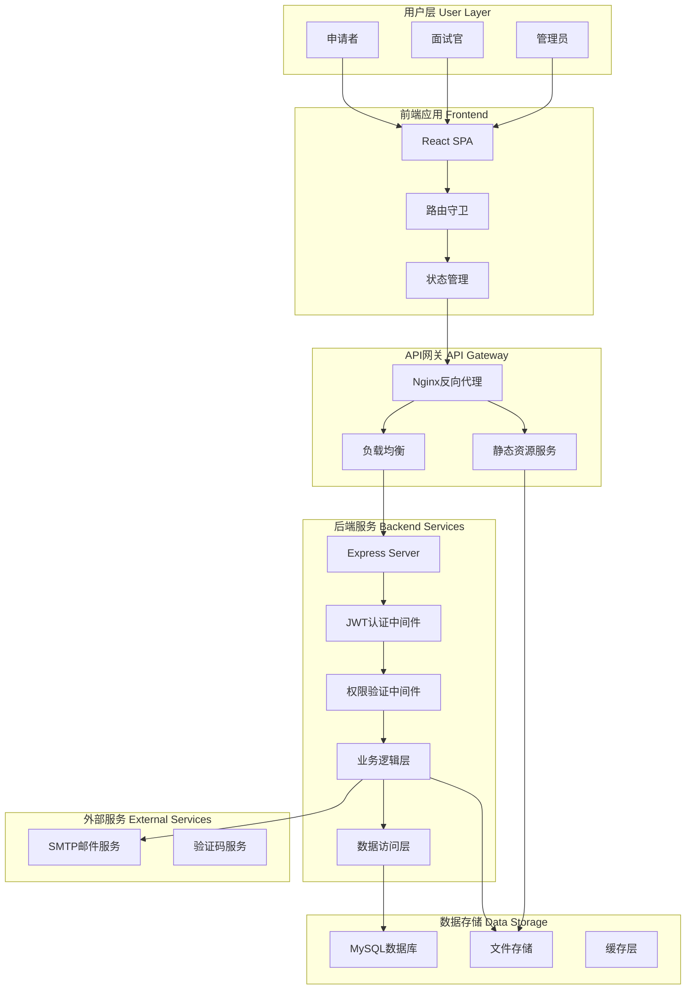
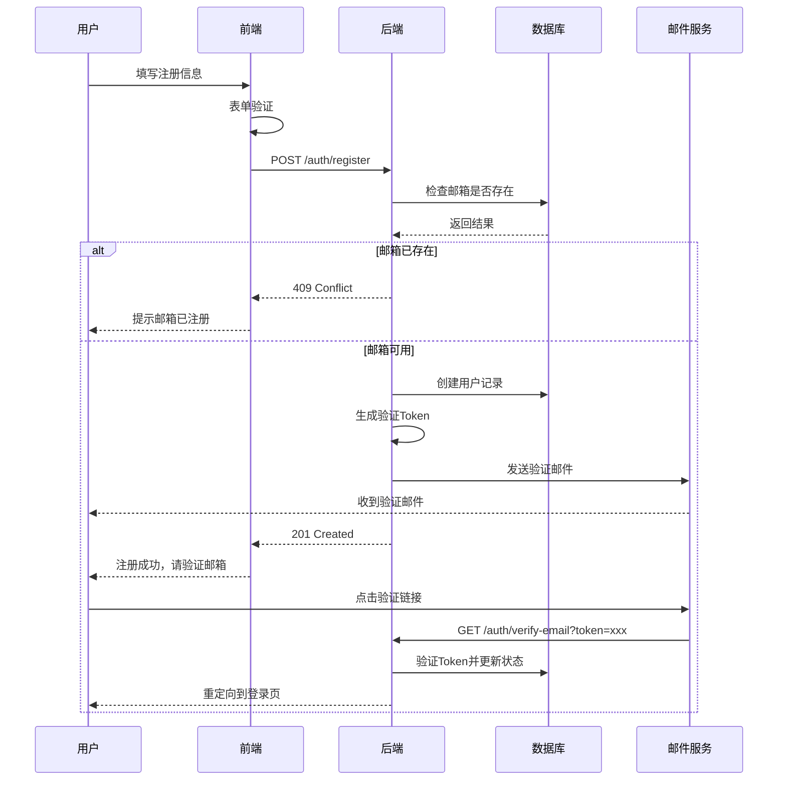
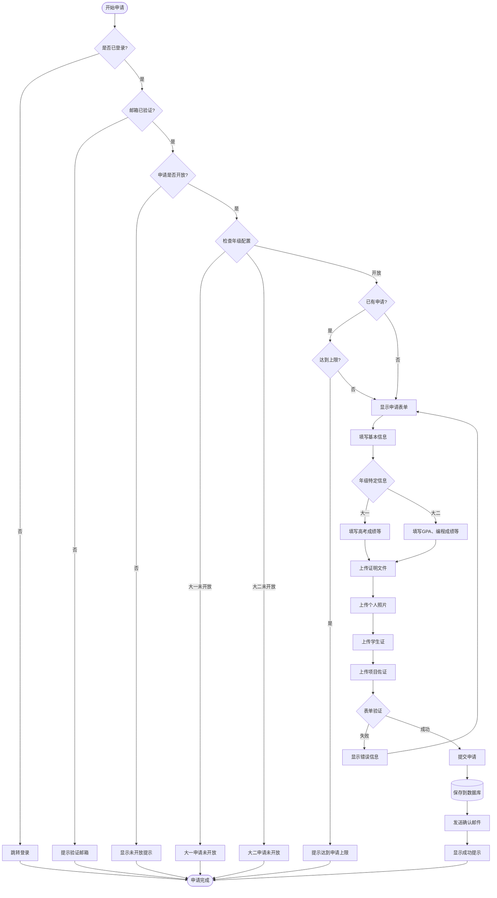
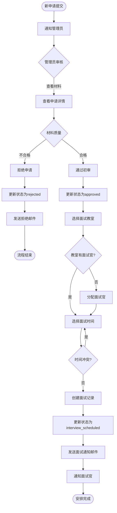
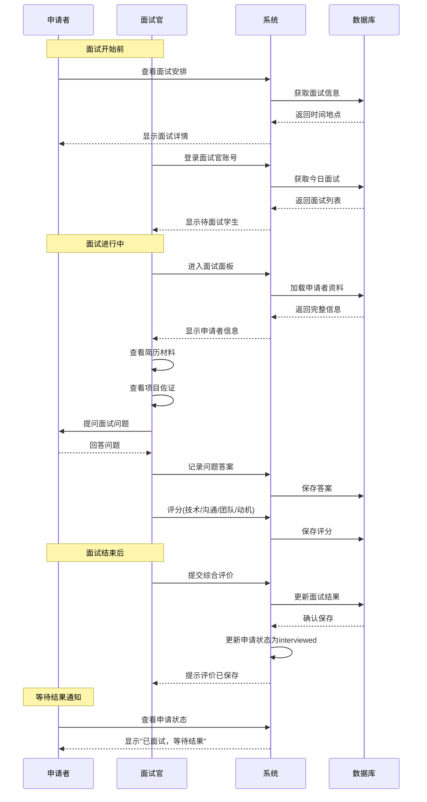
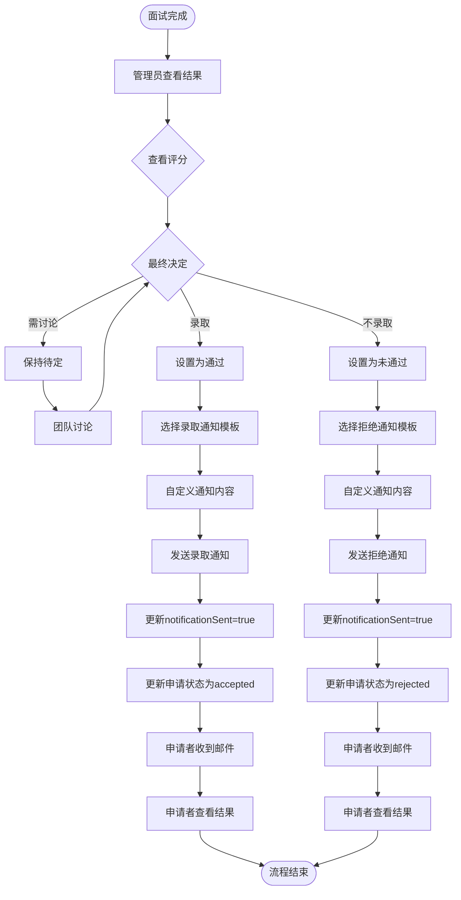
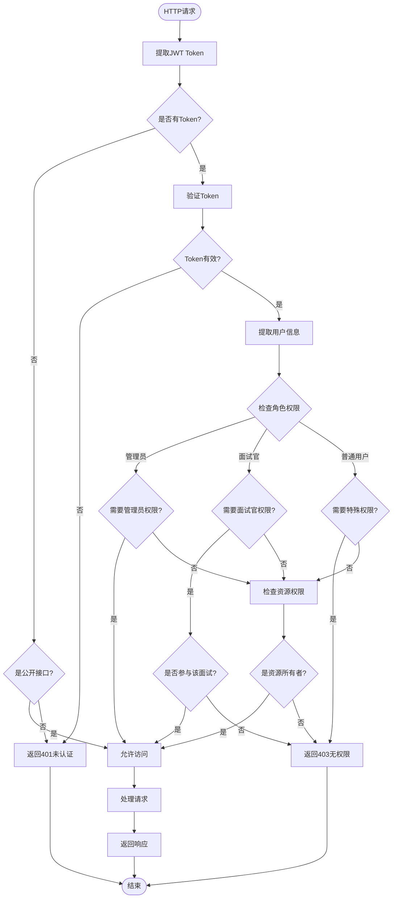
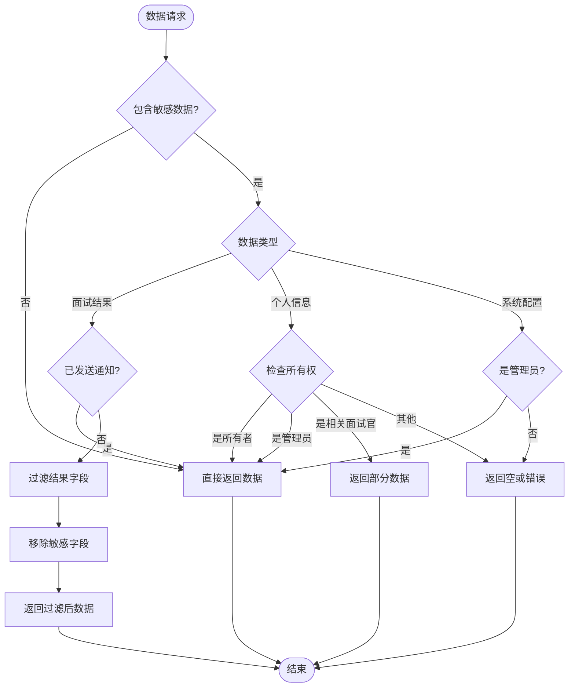
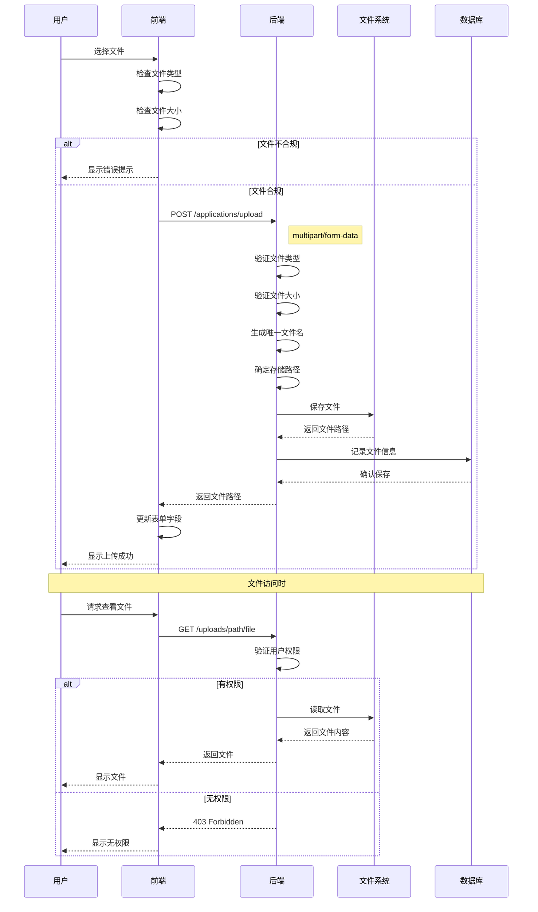
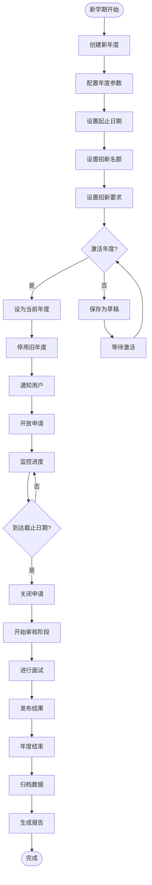

# 业务流程详解

## 1. 系统架构流程

## 2. 用户注册与验证流程

## 3. 申请提交流程

## 4. 审核与面试安排流程

## 5. 面试执行流程

## 6. 结果通知流程

## 7. 权限控制流程

## 8. 数据安全流程

## 9. 文件上传流程

## 10. 年度管理流程

## 流程说明

### 关键节点说明

1. **注册验证**：确保用户邮箱真实有效
2. **申请审核**：多级审核确保质量
3. **面试安排**：自动分配和冲突检测
4. **权限控制**：基于角色的细粒度控制
5. **数据安全**：敏感信息分级保护

### 状态流转

申请状态流转：
- `pending` → `reviewing` → `approved` → `interview_scheduled` → `interviewed` → `accepted/rejected`

面试状态流转：
- `scheduled` → `in_progress` → `completed` → `notified`

### 并发控制

- 使用数据库事务确保数据一致性
- 使用乐观锁防止并发修改
- 使用队列处理邮件发送

### 异常处理

- 所有流程都有异常处理分支
- 关键操作有重试机制
- 错误日志记录和告警

---

*最后更新: 2024年1月*