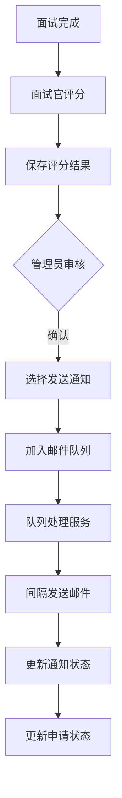

# 面试结果管理模块

## 概述

独立的面试结果管理模块，提供优雅的评分展示、编辑和批量通知功能。

## 功能特性

### 1. 面试结果展示板
- **路径**: `/interview/results`
- **权限**: 管理员和面试官
- **功能**:
  - 卡片式布局展示面试结果
  - 实时编辑评分和备注
  - 显示申请者详细信息
  - 自动计算平均分

### 2. 评分管理
- **评分维度**:
  - 技术能力 (0-100分)
  - 沟通能力 (0-100分)
  - 团队协作 (0-100分)
  - 学习动力 (0-100分)
  - 综合评价 (0-100分)
- **内联编辑**: 直接在列表中修改，无需跳转
- **实时保存**: 点击保存按钮立即更新

### 3. 邮件队列系统
- **批量发送**: 支持选择多个面试结果批量发送
- **智能调度**:
  - 每封邮件间隔2秒
  - 批量处理10封/批
  - 失败自动重试（最多3次）
- **队列监控**: 实时显示待发送、处理中、已完成、失败数量

### 4. 权限控制
| 角色 | 查看范围 | 编辑权限 | 发送通知 |
|------|---------|---------|---------|
| 管理员 | 所有面试结果 | 所有 | ✓ |
| 面试官 | 自己参与的面试 | 自己参与的 | ✗ |
| 申请者 | 无权访问 | ✗ | ✗ |

## API端点

### 面试结果管理
```
GET    /api/interview/results
       查询参数: page, limit, status(all/pending/notified), result(all/passed/failed/pending)
       
PUT    /api/interview/results/:id
       请求体: { evaluationScores, interviewerNotes, result, questionAnswers }
       
POST   /api/interview/results/:id/notify
       发送单个结果通知
       
POST   /api/interview/results/batch-notify
       请求体: { interviewIds: string[] }
```

### 邮件队列管理
```
GET    /api/interview/email-queue/status
       获取队列状态和任务列表
       
POST   /api/interview/email-queue/retry
       重试所有失败的邮件任务
```

## 技术实现

### 后端架构

```typescript
// 邮件队列服务
class EmailQueueService {
  - queue: EmailTask[]
  - processInterval: 2000ms
  - batchSize: 10
  - maxAttempts: 3
  
  + addToQueue(data): taskId
  + addBatchToQueue(emails[]): taskIds[]
  + getQueueStatus(): status
  + retryFailedTasks(): count
}
```

### 前端组件

```typescript
// InterviewResults.tsx
- 统计卡片展示
- 过滤器（状态/结果）
- 批量选择功能
- 内联编辑模式
- 分页控制
```

## 业务流程



## 安全措施

1. **防止重复发送**: 已发送通知的记录被标记，不能再次发送
2. **结果验证**: 只有设置了明确结果（通过/未通过）的面试才能发送通知
3. **权限隔离**: 面试官只能查看和编辑自己参与的面试
4. **状态同步**: 发送通知后自动更新申请状态为accepted/rejected

## 部署步骤

1. **编译代码**
```bash
cd backend && npm run build
cd ../frontend && npm run build
```

2. **使用部署脚本**
```bash
./deploy.sh update
```

## 使用指南

### 管理员操作流程
1. 访问"面试结果"页面
2. 查看所有已完成的面试
3. 编辑需要调整的评分
4. 选择要发送通知的面试记录
5. 点击"批量发送通知"
6. 监控邮件队列状态

### 面试官操作流程
1. 访问"面试结果"页面
2. 查看自己参与的面试
3. 点击"编辑"按钮
4. 修改评分和备注
5. 点击"保存"

## 注意事项

1. **邮件发送限制**: 大量邮件发送可能触发邮件服务商的限制，建议配置专业的邮件服务
2. **队列持久化**: 当前队列存储在内存中，服务重启会丢失，生产环境建议使用Redis等持久化方案
3. **并发控制**: 多个管理员同时操作可能导致冲突，建议添加乐观锁机制

## 后续优化建议

1. **队列持久化**: 使用Redis或数据库存储队列任务
2. **邮件模板**: 支持自定义邮件模板
3. **发送日志**: 记录详细的邮件发送日志
4. **批量导出**: 支持导出面试结果为Excel
5. **统计分析**: 添加面试通过率、评分分布等统计图表
6. **实时通知**: 使用WebSocket实时更新队列状态

---

*模块版本: 1.0.0*
*创建日期: 2024年1月*