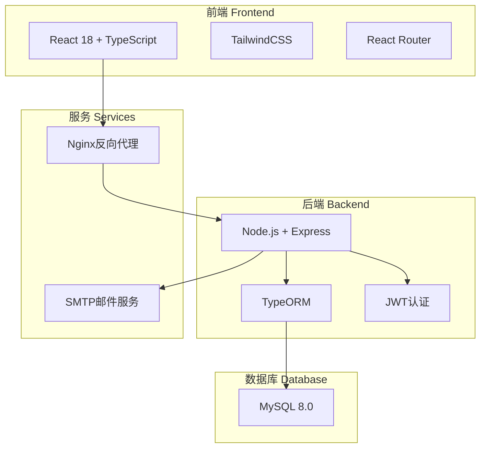
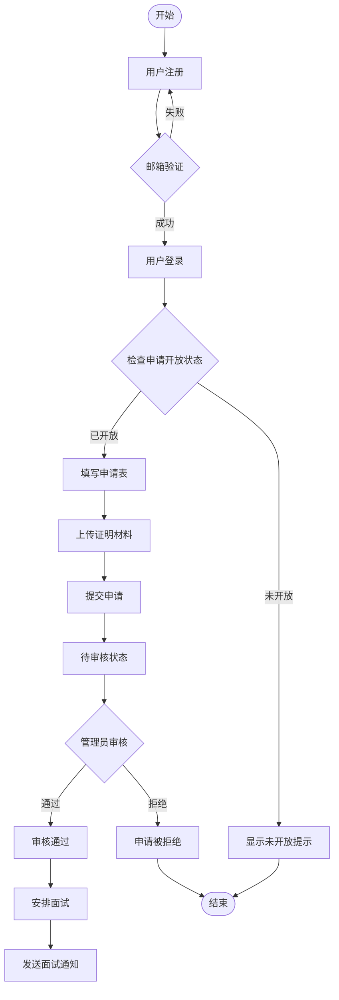
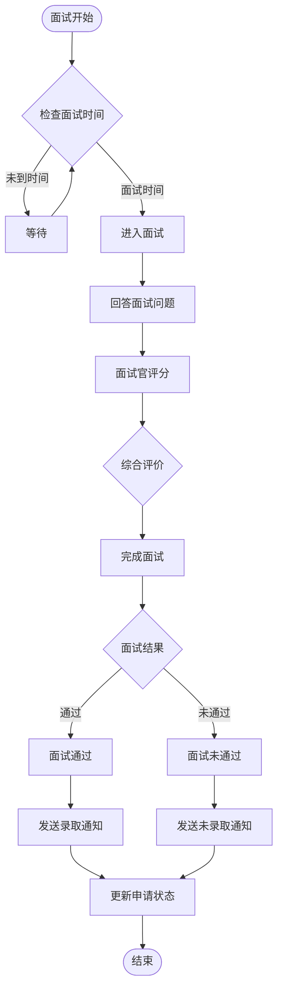
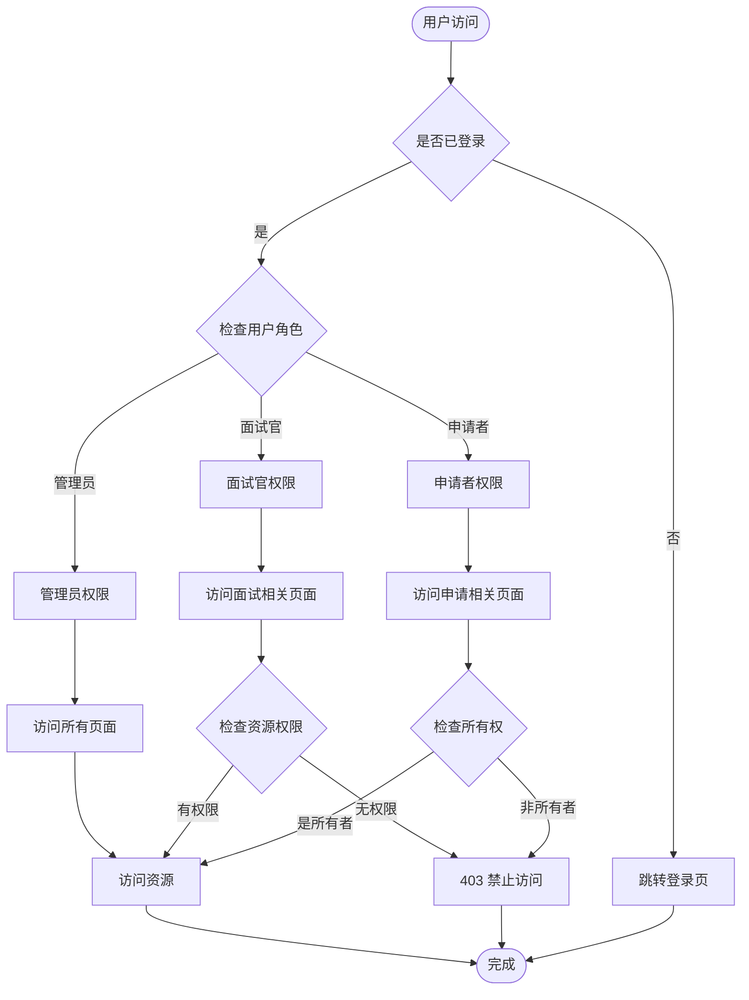

# 代码书院实验室招新管理系统

## 📋 项目概述

代码书院实验室招新管理系统是一个全栈Web应用，用于管理实验室的学生招新流程。系统支持在线申请、材料审核、面试安排、结果通知等完整的招新流程管理。

### 主要特性

- 🎓 **多年级支持**：支持大一、大二学生分别申请，可独立配置开放状态
- 📝 **在线申请**：学生可在线填写申请表，上传证明材料
- 👥 **面试管理**：支持面试官分配、面试安排、在线评分
- 📧 **邮件通知**：自动发送面试安排和结果通知邮件
- 🔐 **权限管理**：区分管理员、面试官、申请者三种角色
- 📊 **数据统计**：实时统计申请和面试数据

## 🏗️ 系统架构



## 📦 技术栈

### 前端
- **框架**: React 18.2.0
- **语言**: TypeScript 4.9.5
- **样式**: TailwindCSS 3.4.1
- **路由**: React Router 6.21.3
- **状态管理**: React Context API
- **HTTP客户端**: Axios 1.6.5
- **日期处理**: date-fns 3.2.0
- **表单**: React Hook Form 7.48.2

### 后端
- **运行时**: Node.js 18
- **框架**: Express 4.18.2
- **语言**: TypeScript 5.3.3
- **ORM**: TypeORM 0.3.19
- **认证**: JWT (jsonwebtoken 9.0.2)
- **验证**: express-validator 7.0.1
- **邮件**: nodemailer 6.9.8
- **文件上传**: multer 1.4.5

### 数据库
- **MySQL** 8.0

### 部署
- **容器化**: Docker & Docker Compose
- **反向代理**: Nginx
- **进程管理**: PM2 (生产环境)

## 🔄 业务流程

### 1. 申请流程



### 2. 面试流程



### 3. 权限管理流程



## 🚀 快速开始

### 环境要求

- Docker 20.10+
- Docker Compose 2.0+
- Node.js 18+ (开发环境)
- MySQL 8.0+ (如果不使用Docker)

### 安装部署

1. **克隆项目**
```bash
git clone <repository-url>
cd code-academy-recruitment
```

2. **配置环境变量**
```bash
# 后端配置
cp backend/.env.example backend/.env
# 编辑 backend/.env 配置数据库和邮件服务

# 前端配置（如需要）
cp frontend/.env.example frontend/.env
```

3. **使用部署脚本**
```bash
# 首次安装
./deploy.sh install

# 更新代码并重新部署
./deploy.sh update

# 查看服务状态
./deploy.sh status

# 查看日志
./deploy.sh logs
```

4. **访问系统**
- 前端: http://localhost:3000
- 后端API: http://localhost:3001/api
- phpMyAdmin: http://localhost:8080

### 默认账号

- **管理员**: admin@codeacademy.com / admin123
- **面试官**: 
  - zhang.senior@mails.cust.edu.cn / 123456
  - li.mentor@mails.cust.edu.cn / 123456

## 📁 项目结构

```
code-academy-recruitment/
├── backend/                 # 后端项目
│   ├── src/
│   │   ├── config/          # 配置文件
│   │   ├── controllers/     # 控制器
│   │   ├── middlewares/     # 中间件
│   │   ├── models/          # 数据模型
│   │   ├── routes/          # 路由定义
│   │   ├── services/        # 业务服务
│   │   └── utils/           # 工具函数
│   ├── uploads/             # 上传文件存储
│   └── package.json
├── frontend/                # 前端项目
│   ├── src/
│   │   ├── components/      # React组件
│   │   ├── contexts/        # Context状态管理
│   │   ├── hooks/           # 自定义Hooks
│   │   ├── pages/           # 页面组件
│   │   ├── services/        # API服务
│   │   ├── types/           # TypeScript类型
│   │   └── utils/           # 工具函数
│   ├── public/              # 静态资源
│   └── package.json
├── docker/                  # Docker配置
├── docker-compose.yml       # Docker Compose配置
├── deploy.sh               # 部署脚本
└── README.md               # 项目文档
```

## 🔒 安全特性

1. **身份认证**
   - JWT Token认证
   - Token过期自动刷新
   - 密码加密存储(bcrypt)

2. **权限控制**
   - 基于角色的访问控制(RBAC)
   - API端点权限验证
   - 资源所有权验证

3. **数据保护**
   - SQL注入防护(参数化查询)
   - XSS防护(输入验证和转义)
   - 文件上传类型和大小限制
   - 敏感信息过滤(面试结果保护)

4. **隐私保护**
   - 面试结果通知前不可见
   - 个人信息访问限制
   - 操作日志记录

## 🛠️ 开发指南

### 本地开发

1. **后端开发**
```bash
cd backend
npm install
npm run dev
```

2. **前端开发**
```bash
cd frontend
npm install
npm start
```

### 代码规范

- 使用TypeScript进行类型检查
- 遵循ESLint规则
- 使用Prettier格式化代码
- Git提交信息遵循约定式提交

### 测试

```bash
# 后端测试
cd backend
npm test

# 前端测试
cd frontend
npm test
```

## 📊 数据模型

### 主要实体

- **User**: 用户账户
- **Application**: 申请表
- **Interview**: 面试记录
- **InterviewRoom**: 面试教室
- **Interviewer**: 面试官
- **EmailTemplate**: 邮件模板
- **SystemConfig**: 系统配置
- **RecruitmentYear**: 招新年度

### 关系说明

- 一个用户可以有多个申请(不同年度)
- 一个申请对应一个面试
- 一个面试可以有多个面试官
- 一个教室可以安排多场面试

## 🔧 配置管理

系统支持动态配置，可通过管理界面修改：

- 申请开放/关闭状态
- 各年级独立控制
- 申请截止时间
- 最大申请数量限制
- 邮件模板配置
- 面试问题库管理

## 📝 更新日志

### v2.0.0 (2024-01)
- ✨ 新增多年度招新支持
- 🔒 加强面试结果隐私保护
- 📧 完善邮件通知系统
- 🎨 UI/UX全面优化
- 🐛 修复已知问题

### v1.0.0 (2023-12)
- 🎉 初始版本发布
- 📝 基础申请流程
- 👥 面试管理功能
- 🔐 用户认证系统

## 🤝 贡献指南

欢迎提交Issue和Pull Request！

1. Fork项目
2. 创建特性分支 (`git checkout -b feature/AmazingFeature`)
3. 提交更改 (`git commit -m 'Add some AmazingFeature'`)
4. 推送到分支 (`git push origin feature/AmazingFeature`)
5. 提交Pull Request

## 📄 许可证

本项目采用 MIT 许可证 - 查看 [LICENSE](LICENSE) 文件了解详情

## 📞 联系方式

- 项目维护：代码书院实验室
- 邮箱：admin@codeacademy.com
- 地址：长春理工大学

## 🙏 致谢

感谢所有为本项目做出贡献的开发者和测试人员！

---

*最后更新: 2024年1月*